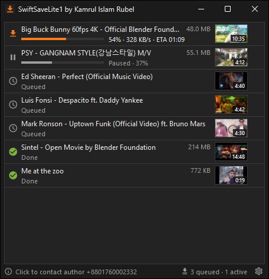
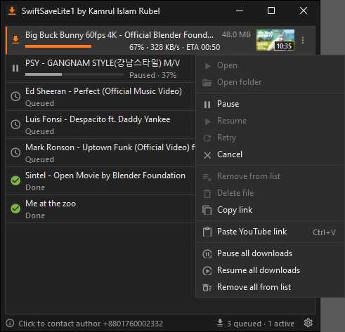
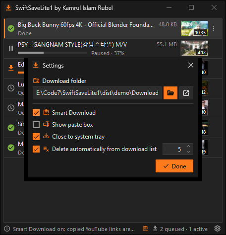
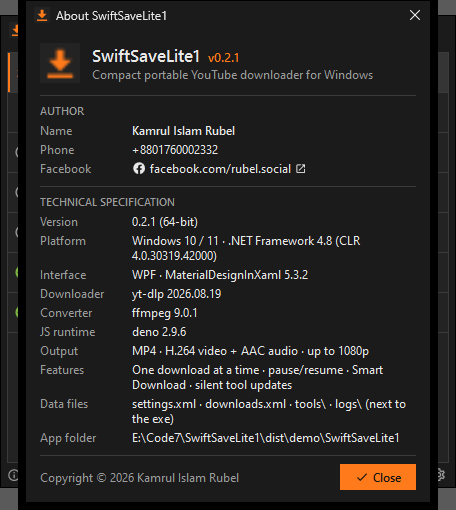
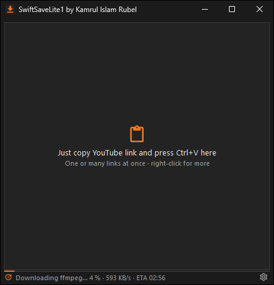
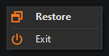

<p align="center">
  
</p>

<h1 align="center">SwiftSaveLite1</h1>

<p align="center">
  <b>A compact, portable YouTube downloader for Windows.</b><br />
  Copy a YouTube link, press <kbd>Ctrl</kbd>+<kbd>V</kbd> and get a 1080p <b>MP4 (H.264 / AAC)</b> file.<br />
  by <b>Kamrul Islam Rubel</b>
</p>

<p align="center">
  <a href="https://github.com/rubeldbc/SwiftSaveLite1-Releases/releases/latest/download/SwiftSaveLite1-0.2.1-win-x64.zip"></a>
</p>

<p align="center">
  
  
  
  
  
</p>

> This repository hosts the **downloads** and the **user guide** of SwiftSaveLite1. The source code is not public.

---

## Contents

- [Highlights](#highlights)
- [Screenshots](#screenshots)
- [System requirements](#system-requirements)
- [Download & install](#download--install)
- [Quick start](#quick-start)
- [Using SwiftSaveLite1](#using-swiftsavelite1)
  - [Adding videos](#adding-videos)
  - [Supported links](#supported-links)
  - [The download list](#the-download-list)
  - [Mouse, keyboard and menus](#mouse-keyboard-and-menus)
  - [Several downloads at once](#several-downloads-at-once)
  - [Settings](#settings)
  - [System tray](#system-tray)
  - [About window and status bar](#about-window-and-status-bar)
- [What happens automatically](#what-happens-automatically)
- [Output files](#output-files)
- [YouTube bot checks, age limits and cookies](#youtube-bot-checks-age-limits-and-cookies)
- [Files in the app folder](#files-in-the-app-folder)
- [Configuration reference (settings.xml)](#configuration-reference-settingsxml)
- [Privacy and network access](#privacy-and-network-access)
- [Troubleshooting / FAQ](#troubleshooting--faq)
- [Version history](#version-history)
- [Third-party software](#third-party-software)
- [Disclaimer](#disclaimer)
- [Author and contact](#author-and-contact)

---

## Highlights

- **Paste and go** — press <kbd>Ctrl</kbd>+<kbd>V</kbd> anywhere in the window. One link, many links, links glued together or mixed with other text: every YouTube video on the clipboard is queued.
- **Smart Download** — on by default: every YouTube link you copy anywhere in Windows (browser, chat, e-mail) is queued automatically.
- **Always MP4** — up to **1920×1080**, H.264 video + AAC audio, plays everywhere. VP9 / AV1 / WebM sources are converted with ffmpeg.
- **Playlists** — paste a playlist link and its videos (up to 500) are queued.
- **Rich list** — the original title right away, a thumbnail with the video length, size, progress bar, percent, speed and ETA.
- **A queue that behaves** — one download at a time by default; start any video immediately (up to 5 at once); pause, resume, retry, cancel; pause all / resume all.
- **Multi-select** — <kbd>Shift</kbd> / <kbd>Ctrl</kbd> + click, then remove, delete files, copy links, retry, pause or resume the whole selection.
- **Survives closing** — partial downloads survive closing the app, a crash or a reboot and continue on the next start.
- **Duplicate protection** — a link already in the list, or a video already in the download folder, is ignored with a short message.
- **YouTube bot-check handling** — uses YouTube's embedded player so downloads keep working when YouTube asks "Sign in to confirm you're not a bot"; automatic fallbacks and timed retries.
- **Self-maintaining** — downloads `yt-dlp`, `ffmpeg` and `deno` on the first start and keeps them up to date silently (running downloads are paused and resumed around an update).
- **Close to tray** — the window's close button keeps the app running in the notification area (Restore / Exit menu).
- **Portable and small** — no installer, no registry, no admin rights; the app is 10 MB (3 MB zipped) and keeps all its state in its own folder.
- **Compact dark UI** — grey and orange, square corners everywhere, Material Design icons.
- **Safe file names** — characters Windows does not allow in file names are replaced automatically; titles in any language are kept.

## Screenshots

| Download list | Item menu |
|---|---|
|  |  |
| **Settings** | **About** |
|  |  |
| **First start: tools download with speed and ETA** | **Tray menu** |
|  |  |

## System requirements

| | |
|---|---|
| Operating system | Windows 11 or Windows 10, 64-bit |
| Runtime | .NET Framework 4.8 — built into Windows 11 and current Windows 10; nothing to install |
| Disk space | ≈ 10 MB for the app, ≈ 220 MB for the tools (yt-dlp 17 MB, ffmpeg 103 MB, deno 97 MB), plus your videos |
| Network | Internet access to YouTube, GitHub and gyan.dev (see [Privacy and network access](#privacy-and-network-access)) |
| Rights | A normal user account; the app folder must be writable |

## Download & install

1. Download **[`SwiftSaveLite1-0.2.1-win-x64.zip`](https://github.com/rubeldbc/SwiftSaveLite1-Releases/releases/latest/download/SwiftSaveLite1-0.2.1-win-x64.zip)** — or pick any version on the [Releases](https://github.com/rubeldbc/SwiftSaveLite1-Releases/releases) page.
2. Unzip it into a folder you can write to, e.g. `D:\Apps\SwiftSaveLite1` (not `C:\Program Files`).
3. Run **`SwiftSaveLite1.exe`**.

> Windows SmartScreen may warn about an unrecognised app because the exe is not code-signed. Choose **More info → Run anyway**.

**Update:** exit the app, replace the exe and the dlls with the new version, keep `settings.xml`, `downloads.xml` and `tools\`.

**Uninstall:** exit the app (tray icon → **Exit**) and delete its folder. Your videos in the download folder are not touched.

## Quick start

1. Start `SwiftSaveLite1.exe`. On the first start the status bar shows the tools being downloaded, e.g. *"Downloading ffmpeg… 42 % · 3.2 MB/s · ETA 00:31"* (about 2–3 minutes).
2. Copy a YouTube link in your browser.
3. With Smart Download on (default) it is queued at once. Otherwise click the SwiftSaveLite1 window and press <kbd>Ctrl</kbd>+<kbd>V</kbd>.
4. The finished MP4 is in `%USERPROFILE%\Downloads\SwiftSaveLite1`. Double-click the item to play it.

## Using SwiftSaveLite1

### Adding videos

| Way | How |
|---|---|
| **Ctrl+V** | Click the window and press <kbd>Ctrl</kbd>+<kbd>V</kbd>. The empty list reminds you: *"Just copy YouTube link and press Ctrl+V here"*. |
| **Right-click → Paste YouTube link** | On the empty list, on any item and on the status bar. |
| **Smart Download** | Copy a link anywhere in Windows; it is queued automatically (orange clipboard icon in the status bar while on). Text the app copies itself (**Copy link**) is ignored. |
| **Paste box** | Turn on **⚙ Settings → Show paste box** to get a link box with a **+** button; <kbd>Enter</kbd> adds the link. Pasting several links into the box queues all of them. |

Several links at once work everywhere: separated by spaces, commas or new lines, mixed with other text, or glued together (`…watch?v=AAAAAAAAAAAhttps://youtu.be/BBBBBBBBBBB`). Each video id is extracted, a clean link `https://www.youtube.com/watch?v=<id>` is built and queued, and the original title appears within a moment.

### Supported links

| Kind | Examples |
|---|---|
| Watch pages | `https://www.youtube.com/watch?v=ID`, `youtube.com/watch?v=ID&t=42s`, `m.youtube.com/…`, `music.youtube.com/…`, `watch?feature=share&v=ID` |
| Short links | `https://youtu.be/ID`, `youtu.be/ID?si=…&t=5` |
| Shorts, live, embeds | `/shorts/ID`, `/live/ID`, `/embed/ID`, `/v/ID`, `/e/ID`, `youtube-nocookie.com/embed/ID`, `attribution_link?…` |
| Bare video id | `aqz-KE-bpKQ` (11 characters on its own line) |
| Playlists | `youtube.com/playlist?list=PL…`, `watch?list=PL…`, `/embed/videoseries?list=PL…` — up to 500 videos are queued |
| Video inside a playlist | `watch?v=ID&list=PL…` downloads only that video |

Not accepted: channel pages (`/@name`, `/channel/…`), other video sites and look-alike domains (`notyoutube.com`, `youtube.com.evil.example`).

### The download list

Each row shows a status icon, the title, a detail line, the size, a thumbnail with the video length and a **⋮** menu button.

| Detail line | Meaning |
|---|---|
| *Queued* | Waiting for its turn |
| *35 % · 328 KB/s · ETA 01:38* | Downloading (orange progress bar) |
| *Converting to MP4…* | ffmpeg is converting a non-H.264 source |
| *Paused · 37 %* | Paused; the partial file is kept |
| *Done* | Finished; double-click to play |
| *Video unavailable*, *Private video*, … | Failed, with the reason |
| *Retry in 01:57 · YouTube bot check* | Waiting for an automatic retry; **Retry** skips the wait |
| *File missing* | The finished file was moved or deleted outside the app |

The list is saved to `downloads.xml` and restored on the next start with every item's last status; interrupted downloads continue. With **Delete automatically from download list** on (default) only the **5** most recent finished downloads stay in the list — their files stay on disk.

### Mouse, keyboard and menus

| Action | Result |
|---|---|
| Double-click a finished item | Play the file in the default player |
| Double-click a downloading item | Pause it |
| Double-click a queued, paused or failed item | Start downloading it now |
| Right-click an item, or click **⋮** | Item menu (below) |
| Right-click the empty list or the status bar | Paste YouTube link · Pause all · Resume all · Remove all from list |
| <kbd>Ctrl</kbd>+<kbd>V</kbd> | Add the links on the clipboard |
| <kbd>Del</kbd> | Remove the selected item from the list |
| <kbd>Shift</kbd>+click / <kbd>Ctrl</kbd>+click | Select a range / add or remove one item |
| <kbd>Esc</kbd> | Close Settings or About |

**Item menu**

| Entry | Does |
|---|---|
| Open | Play the finished file |
| Open folder | Show the file (or the download folder) in Explorer |
| Pause | Stop the download, keep the partial file |
| Resume | Put a paused download back in the queue |
| Retry | Start the download now (also skips a retry wait) |
| Cancel | Stop and delete the partial file |
| Remove from list | Remove the entry (not while it is downloading); the file stays |
| Delete file | Move the finished file to the **Recycle Bin** |
| Copy link | Copy the link — several selected items give one link per line |
| Paste YouTube link | Add the links on the clipboard |
| Pause all downloads | Pause every queued and running download |
| Resume all downloads | Queue every paused, failed or cancelled download again |
| Remove all from list | Clear the list; asks for confirmation when a download is running |

Remove from list, Delete file, Copy link, Retry, Pause and Resume act on **all selected items** when the clicked item is part of the selection.

### Several downloads at once

The queue downloads **one video at a time** in the order the links were added. **Retry**, or a double-click on a queued, paused or failed item, starts that video **right away** next to the running one. At most **5** downloads run at the same time; beyond that the video goes to the front of the queue.

### Settings

Click **⚙** at the right end of the status bar.

| Setting | Default | Effect |
|---|---|---|
| Download folder | `%USERPROFILE%\Downloads\SwiftSaveLite1` | Where MP4 files are saved. 📂 chooses a folder, ↗ opens it in Explorer. The folder is checked for write access. |
| Smart Download | **On** | Queue YouTube links copied anywhere in Windows |
| Show paste box | Off | Show the link box and **+** button above the list |
| Close to system tray | **On** | The window's **×** hides the app to the tray instead of exiting |
| Delete automatically from download list | **On**, keep **5** | Keep only the N most recent finished downloads in the list (0–9999); files are never deleted |

Changes are saved immediately to `settings.xml`.

### System tray

With **Close to system tray** on, clicking **×** hides the window. Downloads, Smart Download and tool updates keep running, and a one-time notification tells you so. The tray icon's tooltip shows the queue, e.g. *"SwiftSaveLite1 · 2 queued · 1 active"*.

- **Click** the tray icon, or right-click → **Restore**, to show the window again.
- Right-click → **Exit** quits the app. Running downloads stop and continue on the next start.
- Starting `SwiftSaveLite1.exe` again also brings the hidden window back.

On Windows 11 new tray icons appear under the **^** (show hidden icons) arrow; drag the icon to the taskbar to keep it visible.

### About window and status bar

- **ⓘ** at the left of the status bar opens **About**: author, phone, Facebook link, app version, .NET and MaterialDesignInXaml versions, installed yt-dlp / ffmpeg / deno versions, output format, data files and the app folder.
- When idle the status bar shows **Click to contact author +8801760002332** (orange on hover), which opens [facebook.com/rubel.social](https://www.facebook.com/rubel.social/).
- Otherwise it shows short messages such as *"Ignored — already in the list: …"*, *"Moved to Recycle Bin: …"* or tool download progress. Errors are red; clicking a failed tool download retries it.
- On the right: the Smart Download icon, the counts (*"3 queued · 1 active"*) and the settings button.

## What happens automatically

| When | What |
|---|---|
| First start | yt-dlp, ffmpeg (only `ffmpeg.exe` is taken from the zip) and deno are downloaded into `tools\` with progress, speed and ETA. Failed downloads are retried; clicking the status text retries by hand. |
| A video is queued | The title comes from YouTube's oEmbed service, the length from yt-dlp metadata and the thumbnail from `i.ytimg.com`. |
| A download finishes | The file is checked with ffmpeg; anything that is not H.264 + AAC in MP4 is converted. Older finished items are trimmed from the list (auto-clean). |
| A duplicate link arrives | It is ignored with a status message for a few seconds: *already in the list* or *already downloaded* (an MP4 with that video id is in the download folder). |
| YouTube bot check, HTTP 429 or 403 | An immediate second attempt with more YouTube player clients, then automatic retries after 2 → 5 → 10 → 20 → 30 → 60 minutes (HTTP 403: 30 s → 2 → 5 min), with a countdown in the list. |
| Network error | Retries after 30 s → 2 min → 5 min. |
| ≈ 15 s after start, then every 12 h | Checks for newer yt-dlp / ffmpeg / deno (at most every 6 h). A newer tool is downloaded, running downloads are paused, the file is swapped (rolled back on failure) and downloads resume — no dialogs. |
| The app is closed or crashes mid-download | The partial file is kept; the download continues on the next start. |
| The exe is started again from the same folder | The running window comes to the front (also from the tray). |
| Windows shuts down or you sign out | The list is saved and the app exits cleanly. |

## Output files

- **Format:** MP4 container, H.264 video, AAC audio.
- **Quality:** the best stream up to **1080p**, preferring H.264 + M4A so that no conversion is needed. Other codecs are re-encoded with `libx264 -preset veryfast -crf 20`, AAC 160 kbit/s and `+faststart`.
- **Name:** `<video title> [<video id>].mp4`, with the title shortened to 100 characters.
- **Sanitising:** `\ / | :` become `-`, `"` becomes `'`, `< > ? *` and control characters are removed, runs of whitespace collapse to one space, leading and trailing dots/spaces are trimmed. Example: `AC/DC: Live?` → `AC-DC- Live [id].mp4`. Titles in any language (Bangla, Korean, …) are kept.
- **Partial files** (`.part`) sit next to the output and are deleted on cancel.

## YouTube bot checks, age limits and cookies

YouTube sometimes answers a network with **"Sign in to confirm you're not a bot"** or HTTP 429. SwiftSaveLite1 always asks YouTube through the regular **and** the embedded web player (`player_client=default,web_embedded`), which kept 1080p downloads working on a blocked network during testing. If a check still appears it retries at once with `web_embedded,mweb,android,tv`, then waits and retries automatically.

For lasting blocks, **age-restricted** or **members-only** videos, let yt-dlp use the cookies of a signed-in browser:

- **cookies.txt** — export your YouTube cookies in Netscape format with a browser extension and save the file as `cookies.txt` next to `SwiftSaveLite1.exe`. It is picked up automatically.
- **Browser cookies** — or set `<CookiesFromBrowser>firefox</CookiesFromBrowser>` in `settings.xml` (see below). `edge`, `chrome`, `brave`, `opera` and others work too; Chromium-based browsers may need to be closed first.

> Treat `cookies.txt` like a password — it gives access to your Google account. Never share it.

## Files in the app folder

```
SwiftSaveLite1\
├─ SwiftSaveLite1.exe                 the app
├─ SwiftSaveLite1.exe.config
├─ MaterialDesignThemes.Wpf.dll       UI library
├─ MaterialDesignColors.dll
├─ Microsoft.Xaml.Behaviors.dll
├─ settings.xml                       your settings (created on first start)
├─ downloads.xml                      the download list with each item's status
├─ cookies.txt                        optional, see above
├─ tools\
│  ├─ yt-dlp.exe  ffmpeg.exe  deno.exe
│  ├─ versions.xml                    installed tool versions
│  └─ cache\                          yt-dlp cache
└─ logs\
   └─ app.log                         diagnostics; rolls over to app.1.log at 1 MB
```

All state files are written atomically (temporary file, then replace), so a crash never leaves a half-written `settings.xml` or `downloads.xml`.

## Configuration reference (settings.xml)

Usually changed through **⚙ Settings**. To edit it by hand, exit the app first and keep the elements **in this order** — elements out of order are ignored and fall back to their defaults:

```xml
<?xml version="1.0" encoding="utf-8"?>
<Settings xmlns:i="http://www.w3.org/2001/XMLSchema-instance">
  <DownloadFolder>D:\Videos\YouTube</DownloadFolder>
  <SmartDownload>true</SmartDownload>
  <WindowLeft>725</WindowLeft>                          <!-- window position and size, saved on close -->
  <WindowTop>276</WindowTop>
  <WindowWidth>470</WindowWidth>
  <WindowHeight>480</WindowHeight>
  <LastUpdateCheckUtc>2026-09-17T00:00:00Z</LastUpdateCheckUtc>
  <CookiesFromBrowser>firefox</CookiesFromBrowser>      <!-- optional, no UI -->
  <ShowPasteBox>false</ShowPasteBox>
  <AutoCleanList>true</AutoCleanList>
  <KeepCompletedCount>5</KeepCompletedCount>            <!-- 0..9999 -->
  <CloseToTray>true</CloseToTray>
</Settings>
```

A missing or unreadable `settings.xml` means defaults. A saved window position that is no longer on screen is ignored.

## Privacy and network access

SwiftSaveLite1 has **no telemetry, no accounts and no ads**. It connects only to:

| Host | Why |
|---|---|
| `youtube.com`, `googlevideo.com` (through yt-dlp) | Video information and the video streams |
| `www.youtube.com/oembed` | Video titles |
| `i.ytimg.com` | Thumbnails |
| `github.com`, `api.github.com` | yt-dlp and deno downloads and version checks |
| `www.gyan.dev` | ffmpeg download and version check (fallback: `github.com/yt-dlp/FFmpeg-Builds`) |
| `www.facebook.com` | Only when you click the contact link |

With Smart Download on, the app reads text copied to the clipboard to look for YouTube links. Nothing leaves your computer except the resulting YouTube requests.

## Troubleshooting / FAQ

<details>
<summary><b>The status bar says the tools could not be downloaded</b></summary>

Check the internet connection and any proxy or firewall that might block `github.com` or `gyan.dev`, then click the red status text to retry. Details are in `logs\app.log`.
</details>

<details>
<summary><b>A video fails with "YouTube bot check" or "rate limit (HTTP 429)"</b></summary>

The app retries on its own (countdown in the list). Downloading a lot in a short time makes YouTube throttle your network, so waiting helps. For a lasting block put a `cookies.txt` next to the exe (see [cookies](#youtube-bot-checks-age-limits-and-cookies)).
</details>

<details>
<summary><b>"Age-restricted video" or "Members-only video"</b></summary>

These need a signed-in account: use `cookies.txt` or `CookiesFromBrowser`.
</details>

<details>
<summary><b>The video is only 360p / 720p</b></summary>

Some videos have no 1080p stream. Occasionally YouTube answers one request with a lower quality — delete the file and use **Retry**.
</details>

<details>
<summary><b>I copied a link but nothing happened</b></summary>

Smart Download may be off (⚙ Settings) or the tools may still be downloading. The link may already be in the list, or its MP4 may already be in the download folder — the status bar says so for a few seconds. You can always click the window and press <kbd>Ctrl</kbd>+<kbd>V</kbd>.
</details>

<details>
<summary><b>I closed the window but the app is still running</b></summary>

That is **Close to system tray**. Use the tray icon → **Exit**, or turn the option off in ⚙ Settings.
</details>

<details>
<summary><b>"Remove from list" is greyed out</b></summary>

A running download cannot be removed. Pause or cancel it first.
</details>

<details>
<summary><b>The download folder cannot be used</b></summary>

The folder must exist and be writable. Choose another folder in ⚙ Settings and avoid protected folders such as `C:\Program Files`.
</details>

<details>
<summary><b>Antivirus or SmartScreen blocks the app or the tools</b></summary>

The exe is not code-signed and `yt-dlp.exe` is sometimes flagged generically. Allow the app folder, or put the tools into `tools\` yourself from the official sources listed under [Privacy and network access](#privacy-and-network-access).
</details>

<details>
<summary><b>Where are the logs?</b></summary>

`logs\app.log` in the app folder (the previous one is `app.1.log`). Please attach it when you report a problem.
</details>

## Version history

| Version | Highlights |
|---|---|
| **0.2.1** | Close to system tray (default on) with a **Restore** / **Exit** tray menu; tray tooltip with queue counts; a second start restores the hidden window |
| **0.2.0** | Ctrl+V anywhere and multi-link paste; optional paste box; settings dialog (folder, Smart Download on by default, show paste box, auto-clean keeping the last N); thumbnails with video length; double-click actions; up to 5 downloads started at once; pause all / resume all / remove all; Shift/Ctrl multi-select; duplicate and already-downloaded detection; About window; contact link; tool download speed and ETA; **YouTube bot-check fix** (embedded player client, fallbacks, HTTP 403 handling) |
| **0.1.0** | First release: link parser and FIFO queue; yt-dlp runner with progress, pause/resume and MP4 conversion; compact grey/orange UI with context menu; Smart Download; silent tool updates; XML persistence; single instance; file-name sanitising; portable package |

## Third-party software

| Component | Used for | License |
|---|---|---|
| [yt-dlp](https://github.com/yt-dlp/yt-dlp) | Downloading from YouTube (fetched on first start) | Unlicense |
| [FFmpeg](https://ffmpeg.org) — [gyan.dev essentials build](https://www.gyan.dev/ffmpeg/builds/) | Merging and converting to MP4 (fetched on first start) | GPL v3 (this build) |
| [Deno](https://deno.com) | JavaScript runtime yt-dlp needs for YouTube (fetched on first start) | MIT |
| [MaterialDesignInXamlToolkit](https://github.com/MaterialDesignInXAML/MaterialDesignInXamlToolkit) 5.3.2 | UI styles and icons | MIT |
| [Microsoft.Xaml.Behaviors.Wpf](https://github.com/microsoft/XamlBehaviorsWpf) | Dependency of MaterialDesignThemes | MIT |

The tools are not included in the zip; the app downloads them from their official release locations.

## Disclaimer

SwiftSaveLite1 is meant for downloading videos you are allowed to download — your own uploads, openly licensed videos, or content whose rights holder permits it. Respect YouTube's Terms of Service and the copyright law of your country. The author is not responsible for misuse.

## Author and contact

**Kamrul Islam Rubel**

- Facebook: [facebook.com/rubel.social](https://www.facebook.com/rubel.social/)
- Phone: +8801760002332
- Downloads: [rubeldbc/SwiftSaveLite1-Releases](https://github.com/rubeldbc/SwiftSaveLite1-Releases)

---

<p align="center">Copyright © 2026 Kamrul Islam Rubel</p>
